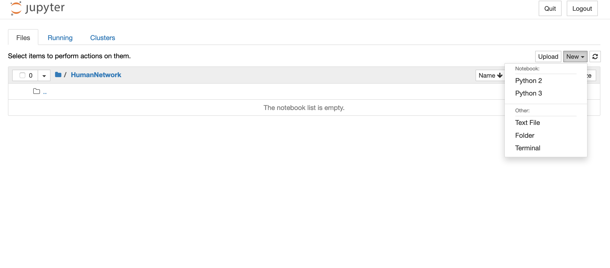
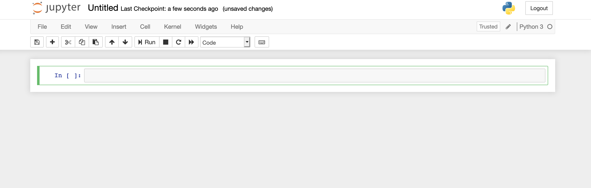

# Networks and Human Behavior
## Tools for computational analysis

### TABLE OF CONTENTS

1. [What you need!](#What-you-need!)

    1.1 [Environment setup and installing the packages](#install)
    

2. [Using Python for  the first time](#first)
    
    
3. [Jupyter Notebook](#jupy) 
    
***

## What you need!

In this class we will use **Python** for our computational analysis.


- To keep the course material self-contained and avoid future incompatibilities you will work in a virtual environment.
- In the virtual environment you can install specific versions of the python modules needed for class.


<div class="alert alert-block alert-info">If you don't know what virtual environments and modules are do not worry, this guide will help you set everything up and will allow you to focus on the course material. If you are comfortable with Python and its virtual environments, feel free to adjust your environment as you see fit. We will only be able to provide support if you work with the versions specified here.</div>  


You can download the minimal version we need here:

<div class="alert alert-block alert-danger">
<b>WINDOWS USERS NOTE:</b> If installing on <b>WINDOWS</b> read carefully the installer messahes and check the box for <b>"Add Python 3.7 in PATH"</b> during the installation process. For Mac, just follow the installer's instructions.
</div>


>> - [Python 3.7.3 for Mac](https://web.stanford.edu/~jacksonm/econ46/Python/Mac/python-3.7.3-macosx10.9.pkg)
>> - [Python 3.7.3 for Windows 64bit](https://web.stanford.edu/~jacksonm/econ46/Python/Windows64bit/python-3.7.3-amd64.exe)

We will also use the following packages  

- Networkx (2.4)
- NumPy (1.16.3)
- Pandas (0.24.2)
- Matplotlib (3.0.3)
- Jupyter (1.0)
- scipy (1.2.1)


***
<a id="install"></a>
### Environment setup and installing the packages


0. To keep things organized, we recommend you create a folder in your computer where you shall keep all the code and data for the class.

 > After creating the folder you will need to use the Command Line Interface (CLI) to get things running.
 > The CLI is an app on your computer that allows you to manage files on your computer. It is also known as cmd, prompt, console or terminal.

**On a Mac** 

1. Download the [mac-module-installation script](https://github.com/EdLaguna/Networks-and-Human-Behavior/blob/master/Install%20Modules%20Scripts/setup_mac.sh.zip) file and save the unzipped version in the folder you just created for the class.

2. Open the CLI: go to Applications then Utilities and click Terminal.

3. Navigate to the class folder within the CLI (e.g. if the folder's directory is Documents/Stanford/Classes/Econ46 you would type `cd Documents/Stanford/Classes/Econ46` and press enter).

4. Type `source setup_mac.sh` and press enter.

> This piece of code will create a virtual environemnt and install all the needed packages there.
> In the future, to work with the material of the class you will always navigate to the folder using the CLI and will need to activate the environment before starting python.

**On Windows**


1. Download the [windows-module-installation script](https://github.com/EdLaguna/Networks-and-Human-Behavior/blob/master/Install%20Modules%20Scripts/setup_windows.cmd.zip) file and save the unzipped version in the folder you just created for the class.

2. Open the Command Line Interface (CLI): go to the start menu and type ``Command Prompt`` in the search field.

3. Navigate to the class folder within the CLI (e.g. if the folder's directory is C:\Users\Yourname\Documents\Stanford\Classes\Econ46 you would type `cd  C:\Users\Yourname\Documents\Stanford\Classes\Econ46` and press enter).

4. Type `setup_windows.cmd` and press enter.


> This piece of code will create a virtual environemnt and install all the needed packages there.
> In the future, to work with the material of the class you will always navigate to the folder using the CLI and will need to activate the environment before starting python.


<div class="alert alert-block alert-info">
    <a id="term"></a>
<b>Terminal / Command Line: </b> 
    To set up Python and our packages you will need to use the command line interface (CLI). The CLI is an app on your computer that allows you to manage files on your computer. It is also known as cmd, prompt, console or terminal. <br>
<br>    
    
When you open a CLI you are usually located in the home directory of your computer and you can move along the folders by using `cd` (change directory) followed by the name of the subfolder you want to access. You can `cd "PATH/folder/"` go deep in the directory by typing the full path on one single line. Enter `cd..` will take you one step back in the direction of the root or home of the folder.     

</div>

<div class="alert alert-block alert-success">
Congrats! You're ready to use Python.
</div>

***

<a id="first"></a>

### Using Python.

As explained before, we will work within our specific virtual environments.

This means, you need to activate the environment before starting and you should, in general, deactivate it when you are done.

**On a Mac** 

> 1. Open Terminal (CLI).
> 2. Navigate to the class folder.
> 3. Type **source econ46_virtual_env/bin/activate**
> 4. Type **python3** and press enter

**On Windows**
> 1. Open the command prompt (CLI).
> 2. Navigate to the class folder.
> 3. Type **econ46_virtual_env\Scripts\activate.bat**
> 3. Type **py** and press enter.

<div class="alert alert-block alert-success">
 Now the Python interpreter is running in your computer. 
</div>

> If you write code in python language in the CLI (your cursor should be blinking next to a `>>>`), your computer will follow the instuctions.
>
> Try typing ``2+2``, press enter and you should see a 4 on the next line.
>
> Type `print('Hello World!')` and press enter.
>
> Now type `exit()` to close the interpreter.

**If done working, then you should deactivate the virtual environment by typing `deactivate` in the CLI (works both for Windows and Mac)**


In principle, we could do all of our analysis directly in the CLI.

We could write Python code using any text editor, save it with a *.py* file extension and submit whole batches of code by entering:

>`python3 file_with_code_name.py` for Mac.
>
>`py file_with_code_name.py` for Windows. 


Nevertheless, it will be easier to work using a more user-friendly interface: **Jupyter Notebooks**

***

<div class="alert alert-block alert-success">
Python beyond this class:
</div>

> After this class, if you wish to expand your use of Python you may want to get a package manager like Anaconda and install it alongside the latest version of Python and many more packages (https://www.anaconda.com/distribution/). There are many great tutorials on how to use such environments and on Python in general. This falls out of the scope of this class so you should not worry about it for the time being. This information is only offered for completeness.


## Jupyter Notebooks
<a id="jupy"></a>

Let's get started! 

0. Open your CLI and navigate to your folder using `cd` to go down the directory (remember CLI will be Terminal for Mac or the Command Prompt for Windows).


1. Activate the virtual environment as explained above!

> <div class="alert alert-block alert-info">
After typing the next command, a new window in your default web browser will open. It will not show a page in a distant computer connected via the internet but rather it will show you the contents of the folder you are currently at in your CLI (potentially empty). 
</div>

2. Type `jupyter notebook` on your CLI. It should look like this.



Like in the image above, go to the right corner and click on New, then click on Python 3.

A new tab will open and you should see something like this:



Click on the grey box and type some Python command (e.g. `2*2` or `print('Hello Jupyter!'`) and then press shift + enter. 

The output shall appear bellow and a new box will be created for you to input more code. You can always go back and edit/re-run previous boxes. 

Now it may not seem like much but in the future you will hopefully appreciate the convenience of this environment.


```python
2*2
```


    4


```python
print('Hello Jupyter!') 
```

    Hello Jupyter!

